<picture>
  <source media="(prefers-color-scheme: dark)" srcset="assets/terminal-session-dark.svg">
  
</picture>

<picture>
  <source media="(prefers-color-scheme: dark)" srcset="https://raw.githubusercontent.com/jamlmao/jamlmao/output/snake-dark.svg">
  
</picture>