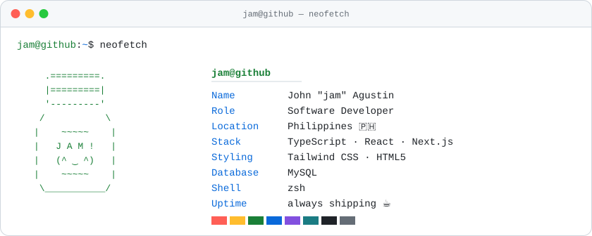

<picture>
  <source media="(prefers-color-scheme: dark)" srcset="assets/terminal-header-dark.svg">
  
</picture>

<picture>
  <source media="(prefers-color-scheme: dark)" srcset="assets/neofetch-dark.svg">
  
</picture>

#### `~$ cat ~/now.txt`

```text
▸ building things for the web with Next.js + Tailwind
▸ sharpening my TypeScript — one strict-mode error at a time
▸ open to collabs and interesting problems — say hi 👋
```

#### `~$ git log --stat`

<picture>
  <source media="(prefers-color-scheme: dark)" srcset="https://github-readme-stats.vercel.app/api?username=jamlmao&show_icons=true&hide_border=true&bg_color=00000000&text_color=8b949e&title_color=3fb950&icon_color=58a6ff&ring_color=3fb950">
  
</picture><picture>
  <source media="(prefers-color-scheme: dark)" srcset="https://github-readme-stats.vercel.app/api/top-langs/?username=jamlmao&layout=compact&langs_count=6&hide_border=true&bg_color=00000000&text_color=8b949e&title_color=3fb950">
  
</picture>

#### `~$ play snake`

<picture>
  <source media="(prefers-color-scheme: dark)" srcset="https://raw.githubusercontent.com/jamlmao/jamlmao/output/snake-dark.svg">
  
</picture>

#### `~$ open linkedin`

[**linkedin.com/in/john-rome-agustin**](https://www.linkedin.com/in/john-rome-agustin-05505b2a3/) — `connection established ✓`
